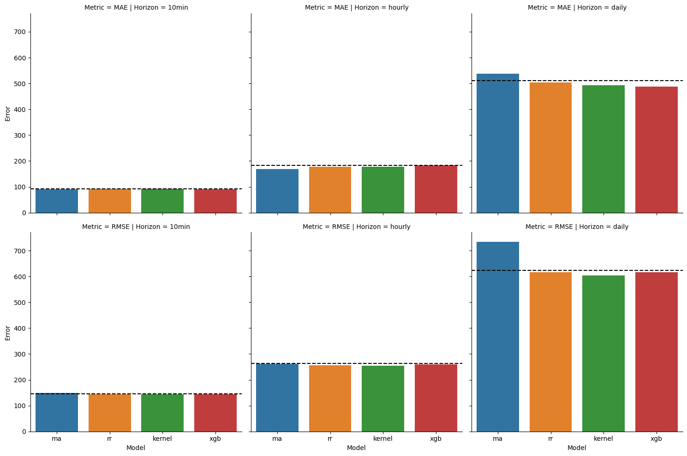
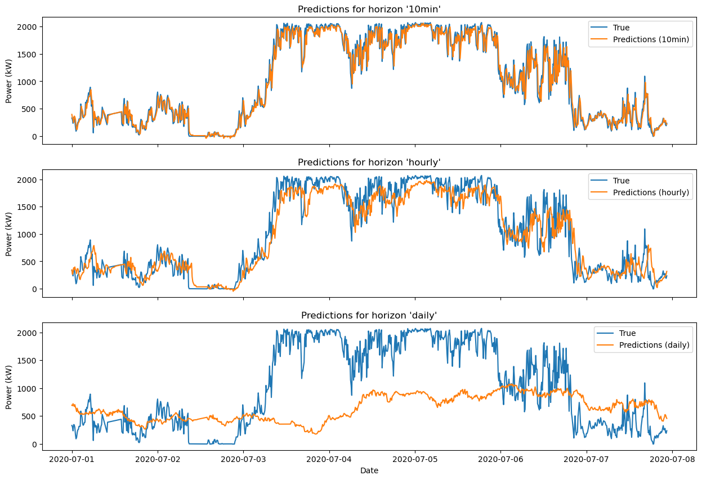
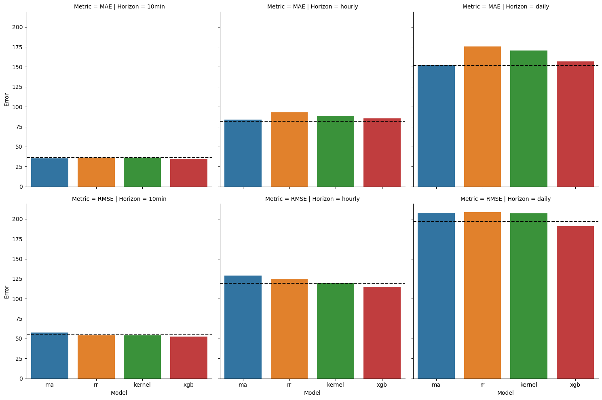
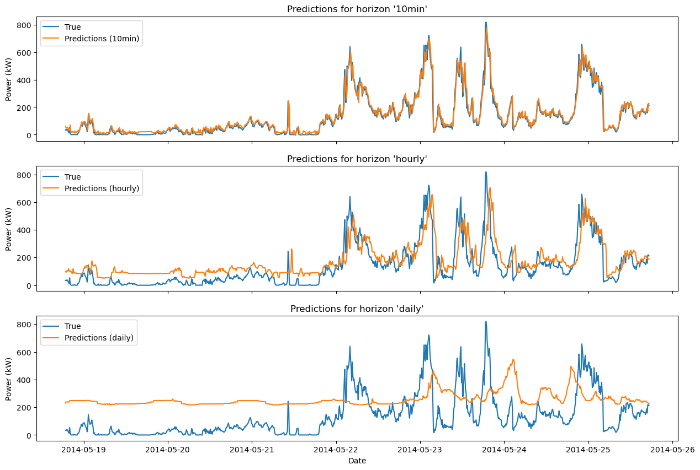
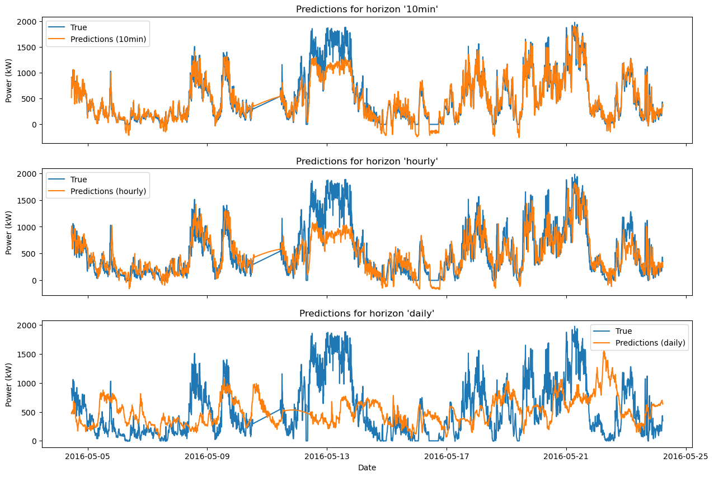

# Forecasting the Power output of a Wind Turbine

### Outline
This is the final project for the seminar __"Machine Learning in Renewable Energy Systems"__. Datasets of a British and a Brazilian wind farm were provided. The primary goal involved predicting the wind power for a minimum of one turbine from each farm for the subsequent time step (10 min), hour, and day. Additionally, participants were tasked with the selection of relevant features, either through manual or automated means. This process, along with all undertaken steps, was to be documented and explained.

## How to use this GitHub repository
1. Clone this repository
2. Set up a new virtual environment with the given environment.yml file
```
conda env create -f environment.yml
```
3. Download the [British data](https://zenodo.org/record/5841834#.ZEajKXbP2BQ) and the [Brazilian data](https://zenodo.org/record/1475197#.ZD6iMxXP2WC) and put them into their corresponding data folder
4. Make sure that your folder structure looks like this:
```
├───data
│   ├───British
│   │   ├───Kelmarsh_SCADA_2016_3082
│   │   ├───Kelmarsh_SCADA_2017_3083
│   │   ├───Kelmarsh_SCADA_2018_3084
│   │   ├───Kelmarsh_SCADA_2019_3085
│   │   ├───Kelmarsh_SCADA_2020_3086
│   │   └───Kelmarsh_SCADA_2021_3087
│   └───Brazilian
│       ├───UEPS_v1.nc
│       └───UEBB_v1.nc
├───notebooks
│   ├───DataInspection.ipynb
│   ├───MovingAverage.ipynb
│   ├───RegressionVariants.ipynb
│   ├───XGBoost.ipynb
│   └───Evaluation.ipynb
├───src
├───.gitignore
├───environment.yml
└───README.md
```
5. You should now be able to run all the notebooks. For every examined model there is a corresponding notebook. Additionally, there is a notebook for the data inspection and one for the overall evaluation and comparison of the models. Please make sure that you select the correct kernel, i.e. the one from the virtual environment you created in step 2. 

Each notebook is self-contained, allowing you to execute it independently without relying on the others. However, there are references within them. Therefore, we advise running the notebooks in the suggested sequence:

1. _DataInspection.ipynb_
2. _MovingAverage.ipynb_
3. _RegressionVariants.ipynb_
4. _XGBoost.ipynb_
5. _Evaluation.ipynb_

Please run the cells of the respective notebooks in the corresponding order since we overwrite some variables in rare cases.

## Models

Overall, we examine four different models within this project:

1. _Moving Average_ (ma)
2. _Ridge Regression_ (rr)
3. _Kernel Ridge Regression_ (kernel)
4. _XGBoost Regression_ (xgb)

For a detailed description of the models please refer to the corresponding notebooks, where hyperparameter tuning, forecasting performance and the transfer learning challenge are discussed. 
Please find the implementation of the models in the src/models folder.

All models are implemented according to the BaseEstimator class of sklearn. This design enables efficient hyperparameter tuning through the use of GridSearchCV and RandomizedSearchCV.

In each case we discuss, it is essential to apply one or more transformations to the time series data. The classes responsible for these transformations can be found in the src/datahandling/preprocessing.py. Importantly, these transformation classes are also compatible with sklearn, making them suitable for integration into a pipeline. You can find a short overview of the transformers at the end of the data inspection notebook.

## Results

This section provides a concise summary of the results. For more comprehensive information, please consult the evaluation notebook and the individual notebooks for each respective model.

### British Wind Farm 

The following plot shows the performance with respect to the mean average error (MAE) and the root mean squared error (RMSE). The dashed lines in each subplot present the benchmarks given for this particular setting.



Employing the models on the British wind farm is successful. Most models show superior performance compared to both of the benchmarks, with the exception being the _Moving Average_ model, which falls short when it comes to daily forecasting. 
The following plot shows the forecast of the _Ridge Regression_ model of the first 1000 values in the test period against the true values:



### Brazilian Wind Farm

The following plot shows the performance with respect to the mean average error (MAE) and the root mean squared error (RMSE). The dashed lines in each subplot present the benchmarks given for this particular setting.



For the Brazilian wind farm, the results are mixed. Only the _XGB_ model is able to outperform the benchmarks across several tasks.
The following plot shows the forecast of the _XGB_ model of the first 1000 values in the test period against the true values:



### Transfer Learning Challenge

All the models achieve good results when applying normalization to all variables (target and predictors). As an example we show the forecasting performance of the _Ridge Regression_ model on the British wind farm when trained on the Brazilian wind farm. For a further discussion of the results please refer to the corresponing section in the notebooks.



## Conclusion

All the models produce generally satisfactory results, both visually and in terms of metrics.
In summary, we conclude that for the given task, the _Ridge Regression_ and _XGB_ models stand out as the top choices. _Ridge Regression_ is the preferred option when computational efficiency and interpretability are prioritized. On the other hand, _XGB_ is the optimal choice when aiming for the highest possible performance across all datasets.

Note hat in this project, our focus is solely on the examination of supervised learning approaches. However, potential future endeavors might involve exploring purely time series-driven techniques like SARIMA. Additionally, we could explore deep learning approaches, with Long Short-Term Memory networks (LSTMs) being a suitable architecture for handling time series data. Moreover, considering our transformation of the data into a supervised learning problem, we could also consider the use of a straightforward Multi-Layer Perceptron (MLP).
Moreover, a more comprehensive investigation into the hyperparameter space of computationally intensive models such as _XGB_ and _Kernel Ridge Regression_ could be conducted, leveraging additional computational resources. This could potentially lead to improved outcomes.

### References
- Harris, C.R., Millman, K.J., van der Walt, S.J. et al. Array programming with NumPy. Nature 585, 357–362 (2020). DOI: [10.1038/s41586-020-2649-2](https://www.nature.com/articles/s41586-020-2649-2).
- The pandas development team. (2023). pandas-dev/pandas: Pandas (v2.1.0). Zenodo. https://doi.org/10.5281/zenodo.8301632
- Chen, T. & Guestrin, C., 2016. XGBoost: A Scalable Tree Boosting System. In Proceedings of the 22nd ACM SIGKDD International Conference on Knowledge Discovery and Data Mining. KDD &#x27;16. New York, NY, USA: ACM, pp. 785–794. Available at: http://doi.acm.org/10.1145/2939672.2939785.
- Pedregosa, F. et al., 2011. Scikit-learn: Machine Learning in Python. Journal of Machine Learning Research, 12, pp. 2825–2830.
- Waskom, M. L., (2021). seaborn: statistical data visualization. Journal of Open Source Software, 6(60), 3021, https://doi.org/10.21105/joss.03021
- Hoyer, S. & Hamman, J., (2017). xarray: N-D labeled Arrays and Datasets in Python. Journal of Open Research Software. 5(1), p.10. DOI: https://doi.org/10.5334/jors.148
- Galli, S., (2021). Feature-engine: A Python package for feature engineering for machine learning. Journal of Open Source Software, 6(65), 3642. https://doi.org/10.21105/joss.03642

